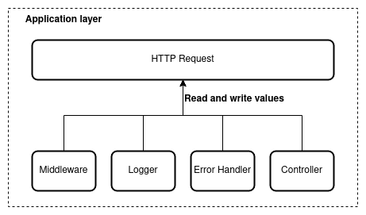
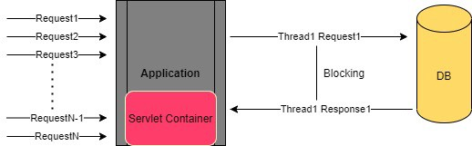

# What is _global_?

_Global_ is an abstract concept and it requires a scope.

* Browser: window object
* NodeJS: global object
* HTTP: request object

# HTTP Request State



* Read and write values from all components
* Avoid passing request as parameter to all functions

# Web Programming Models

* Thread per Request model (tomcat, jetty)
* Reactive model (event loop) (netty, nodejs)

# Thread per Request model



* Threads are blocked during the request execution
* IO operations are CPU-bound
* Operating systems provide a Thread Local Storage (TLS)

# Reactive model


# Storing state in NodeJS

Node provides the `AsyncLocalStorage` class to store data during an async call chain.

```javascript
const als = new AsyncLocalStorage()

als.run(storeObject, () => {
    // async calls chain in the context of this ALS.
    // ...
    als.getStore()
})
```
